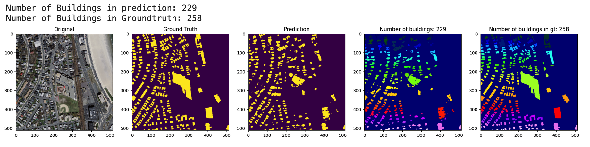
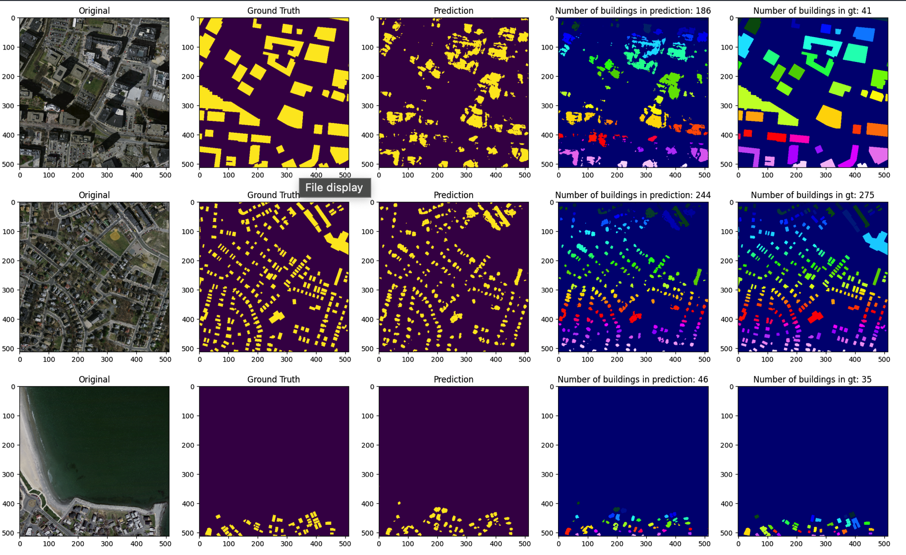
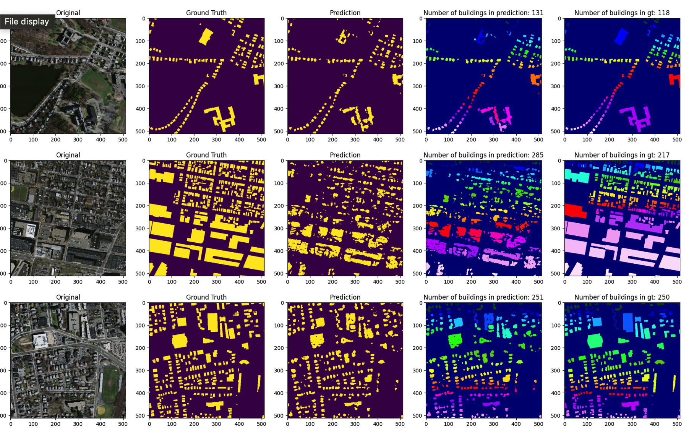

# Building Segmentation
## 📖 About the Project 
This project is a simple image extraction of buildings and counting of buildings. The above files have the Code to the project. This was mainly done on Masasuchets Data set. We used Encoder - Decoder module to achieve this results.

Thankyou.

---

## 🖼️ Project Preview
Here’s how it looks:

  

<!-- Replace with screenshot of your project -->

---

